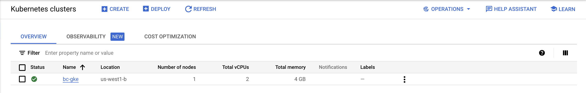
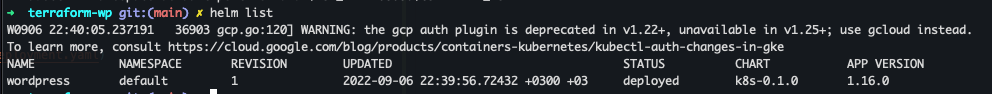
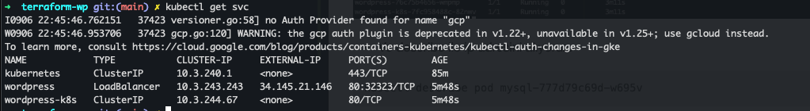
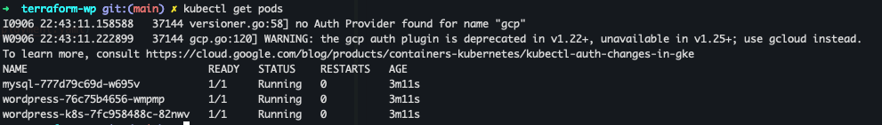
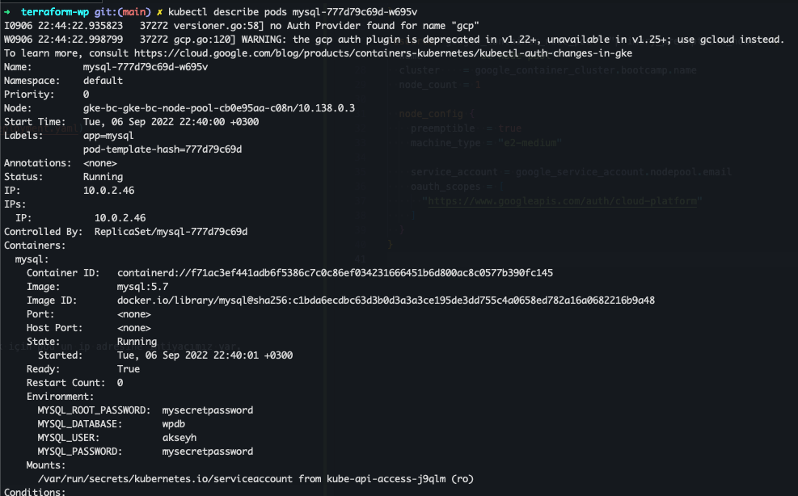
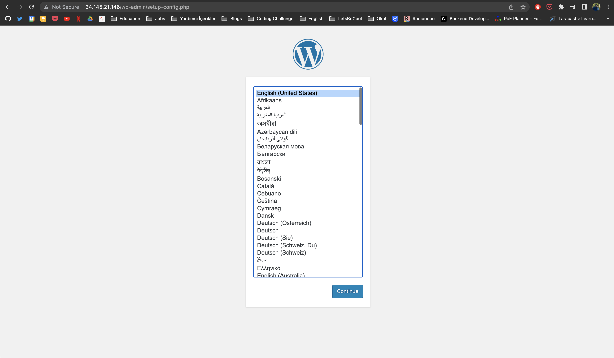
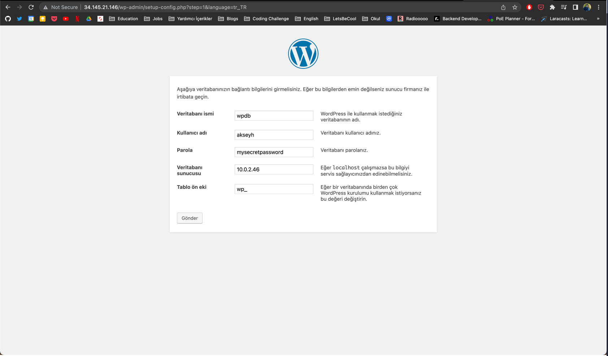
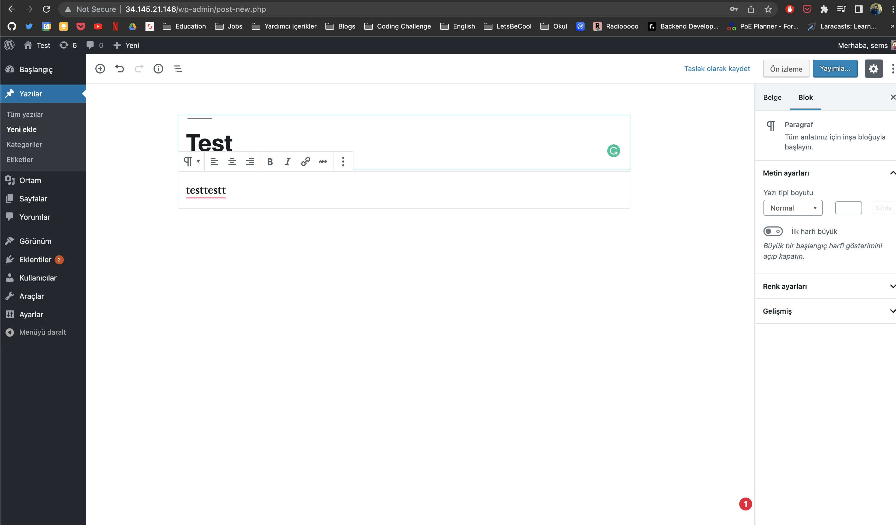
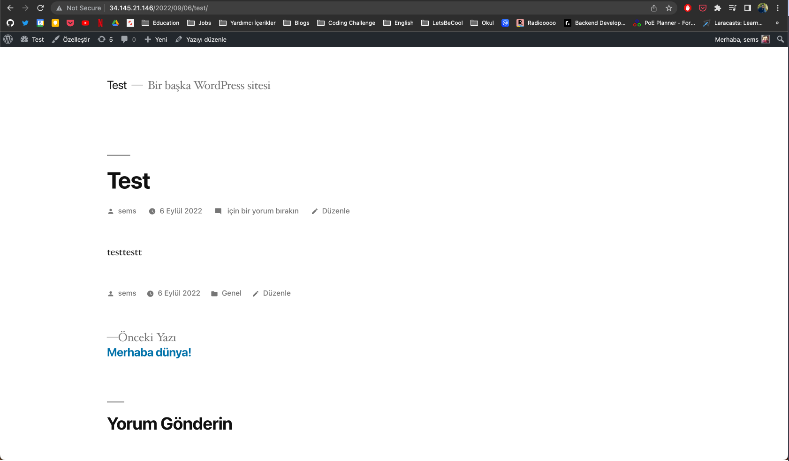

# terraform-wp

## Project Description
WordPress installation on Google Cloud Platform with Terraform.

## Terraform Ayarları

> [](./terraform/main.tf)

* İlk olarak provider "google" belirledik ve proje id'sini belirttik. Ayrıca region ve zone belirttik.
```t
provider "google" {
  project = "fine-bit-361518"
  region  = "us-west1"
  zone    = "us-west1-b"
}
```

* "google_compute_network" ile sanal bir network oluşturduk.
```t
resource "google_compute_network" "vpc_network" {
  name                    = "bc-network"
  auto_create_subnetworks = "true"
}
```

* Cluster oluşturduk. Default node pool'u siliyoruz. Network oluştuktan sonra buraya eklenecek.
```t
resource "google_container_cluster" "bootcamp" {
  name = "bc-gke"

  remove_default_node_pool = true
  initial_node_count       = 1

  network = google_compute_network.vpc_network.name
}
``` 

* "google_service_account" ayarları.
Service account'u kullanıcı gibi servislere bağlanmak için kullanıyoruz.
```t
resource "google_service_account" "nodepool" {
  account_id   = "bc-serviceaccount"
  display_name = "BC Service Account"
}
```

* "google_container_node_pool" ayarları.
```t
resource "google_container_node_pool" "primary_preemptible_nodes" {
  name       = "bc-node-pool"
  cluster    = google_container_cluster.bootcamp.name
  node_count = 1

  node_config {
    preemptible  = true
    machine_type = "e2-medium"

    service_account = google_service_account.nodepool.email
    oauth_scopes = [
      "https://www.googleapis.com/auth/cloud-platform"
    ]
  }
}
```

* Terraform ile plan oluşturmak.
```bash
terraform plan --out plan.out
```

* Ve uygulamak için apply komutu giriyoruz.
```bash
terraform apply plan.out
```

* Google Console'da cluster'ı kontrol ediyoruz.


## Helm Ayarları

* Helm dosyası oluşturma
```bash
helm create helm 
```

`helm` klasörü içerisinde wordpress ve mysql için gerekli yaml dosyalarını oluşturacağız.

* **Wordpress Deployment**
> wordpress:5.1.1-php7.3-apache image'ı ile bir deployment oluşturur.

[Wordpress Deployment](./helm/templates/wordpress-deployment.yaml)

* **Wordpress Service**
> Burada önemli nokta type olarak LoadBalancer seçtik ki kubernetes bizim için bir adres oluştursun ve uygulamamıza bu adresten erişebilelim.

[Wordpress Service](./helm/templates/wordpress-service.yaml)

* **MySQL Deployment**

> MySQL kurulumunda gerekli bilgiler env altında yazıyor.
```yaml
- env:
  - name: MYSQL_ROOT_PASSWORD
    value: mysecretpassword
  - name: MYSQL_DATABASE
    value: wpdb
  - name: MYSQL_USER
    value: akseyh
  - name: MYSQL_PASSWORD
    value: mysecretpassword
```

[MySQL Deployment](./helm/templates/mysql-deployment.yaml)

* Helm install
```bash
helm install wordpress helm
```

* Helm list


* Kubectl serviceleri
```bash
kubectl get svc
```

> LoadBalancer bize bir adres tanımlamış ve bu adres üzerinden wordpress'e erişebiliyoruz.



* Wordpress panelden MySQL bağlantısı yapmak için pod'un ip adresine ihtiyacımız var.
* Önce podları listeliyoruz.
```bash
kubectl get pods 
```


* Ve describe ile ip adresini alıyoruz.
```bash
kubectl describe pod mysql-777d79c69d-w695v
```

> Görüldüğü üzere ip adresi ve environment bilgileri de görünüyor.



* Artık external ip üzerinden wordpress uygulamasına erişebilmeliyiz.


* Pod açıklamasında env değerlerini de ayarlara girdikten sonra panele erişebiliriz.


* Test için bir yazı girelim ve görüntülemeye çalışalım.


* Beklendiği gibi veritabanı da başarılı bir şekilde çalışıyor.


* http://34.145.21.146/2022/09/06/test/ adresinden erişilebilir durumda.